# FeatureFlow-AI 🚀

> **An automated roadmap engine that turns raw user feedback into a prioritized strategy using AI-driven RICE scoring.**


## 🛑 The Problem
Product Managers are drowning in feedback. Whether it's from sales calls, support tickets, or user forums, the data is unstructured and overwhelming. 
- **Gut Instinct vs. Data:** prioritization often falls back to "who shouted the loudest?"
- **Manual Toil:** Maintaining spreadsheets of feature requests is slow and error-prone.
- **Analysis Paralysis:** With hundreds of ideas, it's impossible to spot the high-impact "low hanging fruit."

## 💡 The Solution
FeatureFlow-AI is an autonomous agent that acts as your **24/7 Product Strategist**. It intercepts user feedback, understands the context using LLMs, and mathematically scores every request in real-time.

It doesn't just list ideas; it **visualizes your strategy**.

## 🏗️ System Architecture

The system enables a "set it and forget it" pipeline for feature prioritization.

```mermaid
graph LR
    A[📝 Tally Form] -->|Raw Feedback| B(n8n Webhook)
    B -->|Process Input| C{Gemini Agent}
    C -->|Analyze Context| C
    C -->|Calculate R.I.C.E.| D[(Supabase DB)]
    D -->|Real-time Sync| E[React Dashboard]
    
    style A fill:#f9f,stroke:#333
    style B fill:#f96,stroke:#333
    style C fill:#4285f4,stroke:#fff,color:#fff
    style D fill:#3ecf8e,stroke:#333
    style E fill:#61dafb,stroke:#333,stroke-width:2px
```



## 🧠 Technical Deep Dive: The AI Logic

### 1. The RICE Algorithm
Every feature is scored against four key metrics to generate a single **Strategy Score**:
$$ RICE Score = \frac{Reach \times Impact \times Confidence}{Effort} $$

- **Reach:** How many users will this impact over a given period?
- **Impact:** How much will this increase conversion/retention? (0.25 - 3.0 scale)
- **Confidence:** How specific is the request? (50% - 100%)
- **Effort:** How many "person-months" will this take? (Estimated by AI)

### 2. Intelligent Extraction
Raw feedback is messy. The Gemini Agent parses text such as:
> *"I literally cannot use this app at night, it burns my eyes! Please fix this."*

And extracts structured data:
- **Feature Name:** "Dark Mode Theme"
- **Category:** "UX / Accessibility"
- **Reasoning:** "Critical for user retention and accessibility compliant."
- **Scores:** assigns high Impact and Confidence based on emotional sentiment.

## ⚡ Key Features

### 🎯 Strategy Matrix (Scatter Plot)
The dashboard instantly visualizes the **ROI** of every feature.
- **X-Axis (Effort):** Left is better (easier to build).
- **Y-Axis (Score):** Top is better (higher impact).
- **The "Quick Wins" Zone:** Features in the **Top-Left quadrant** are your golden opportunities—high impact, low effort.

### 📋 Interactive Kanban Board
A drag-and-drop style interface to manage the lifecycle of your features.
- **Status Lanes:** New 📥 -> Planned 🗓️ -> In Progress 🚀
- **Live Sync:** Moving a card updates the database instantly via Supabase.
- **Smart Sorting:** The "New" column automatically prioritizes the highest RICE scores at the top.

### 🎨 Premium Glassmorphism UI
Built with **React + Tailwind CSS** (Slate-950 theme). Features real-time responsive charts (`recharts`), dynamic "pill" badges, and a "breathing" dark mode aesthetic.

## 🛠️ Setup Instructions

### Prerequisites
- Node.js (v18+)
- Supabase Account
- Google Gemini API Key (for the n8n agent)

### 1. Database Setup
Run this SQL in your Supabase SQL Editor to create the schema:

```sql
CREATE TABLE feature_requests (
  id BIGINT GENERATED BY DEFAULT AS IDENTITY PRIMARY KEY,
  raw_feedback TEXT NOT NULL,
  feature_name TEXT,
  category TEXT, 
  reasoning TEXT,
  reach_score INT,
  impact_score FLOAT,
  confidence_score FLOAT,
  effort_score INT,
  final_rice_score FLOAT,
  status TEXT DEFAULT 'New',
  created_at TIMESTAMPTZ DEFAULT NOW()
);
```

### 2. Frontend Setup
Clone the repo and install dependencies:

```bash
git clone https://github.com/2007Sachin/Prioritizer-Agent.git
cd Prioritizer-Agent
npm install
```

### 3. Environment Config
Create a `.env` file in the root directory:

```env
VITE_SUPABASE_URL=your_supabase_project_url
VITE_SUPABASE_ANON_KEY=your_supabase_anon_key
```

### 4. Run Locally
```bash
npm run dev
```

---
*Built with ❤️ using React, Tailwind, Recharts, and Supabase.*
